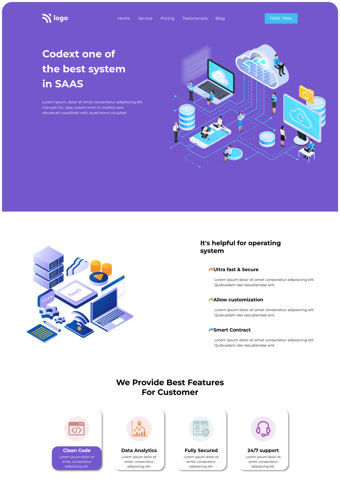
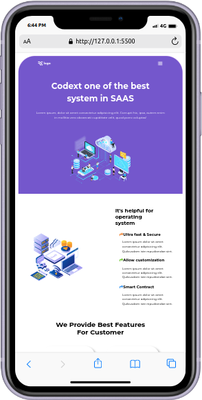

# SAAS Landing Page

- This project is a SAAS landing page.This website is designed using pure HTML and CSS. Also I made this website responsive.

- It took me 5-6hrs to make this project.Please find link of the project below:

---

## Breakpoint

- I have taken **Three** breakpoints for making it responsive.

  - At **968px**
  - At **820px**
  - At **524px**

## Screenshot

- Desktop view

  

- Mobile View

  

---

## 🛠 Skills learned

HTML, CSS, Responsive wesites

---

## 🚀 About Me

### Hey, I am Yasir lambawala

- I am born and brought up in Vadodara, Gujarat. I have done my Btech at GTU university and I am currently learning Web-development.

---

## Feedback

- If you have any feedback, please reach me at lambawalay@gmail.com
